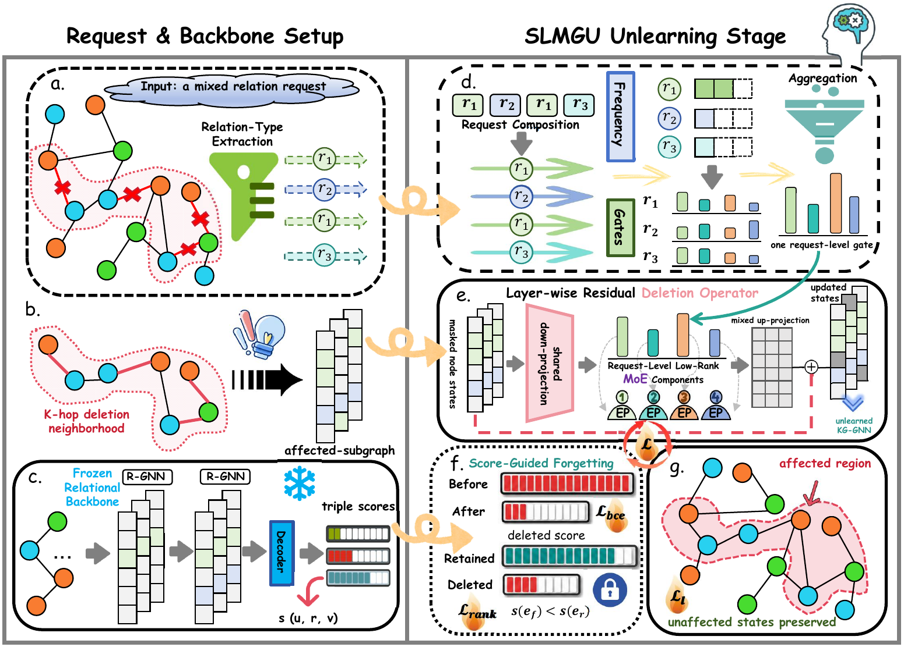
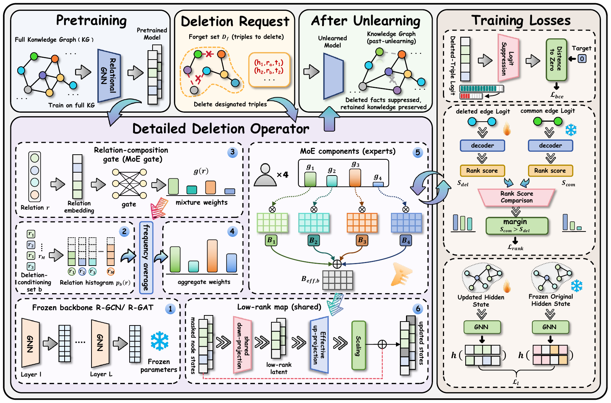

# SLMGU: Score-Guided Low-Rank Mixture for Knowledge Graph Triple Unlearning

This repository contains the anonymous implementation accompanying an anonymous submission on knowledge graph triple unlearning.

SLMGU updates a pretrained relational graph neural network after a request to forget selected triples. It freezes the original backbone, applies lightweight residual deletion operators to the affected subgraph, and optimizes an operational deletion-faithfulness objective: deleted triples should lose their observed-edge score advantage while retained knowledge remains useful.

> **Scope.** SLMGU targets empirical deletion faithfulness. It does not provide certified unlearning or guarantee functional equivalence to retain-only retraining.

## Method at a Glance

<p align="center">
  
</p>

A deletion request can contain several relation types. SLMGU uses the request composition to produce one request-level gate and combines a small bank of shared low-rank components. The resulting operator is injected into exposed states of a frozen relational GNN.

The method has three main parts:

1. **Request-conditioned low-rank mixture.** The relation histogram of the forget request controls the mixture weights over shared low-rank components.
2. **Score-guided forgetting.** Negative-label binary cross-entropy suppresses deleted-triple logits, while same-relation ranking pushes deleted triples below retained anchors.
3. **Locality preservation.** A layer-wise representation loss limits collateral changes outside the directly affected region.

## Detailed Framework

<p align="center">
  
</p>

The released implementation represents SLMGU with the following configuration choices:

```yaml
unlearning_model: gnndelete
deletion_operator: relation_lora_moe
del_lora_base_mode: identity
loss_r_type: bce_rank_l2
rank_same_relation: true
```

The relation-composition gate, expert bank, shared low-rank projection, score losses, and locality loss are implemented in:

| Function | Location |
|---|---|
| Deletion operators and relation gate | `framework/models/deletion.py` |
| SLMGU training loop | `framework/trainer/gnndelete_nodeemb.py` |
| Score-loss utilities and sampling | `framework/utils.py` |
| DT/DF evaluation | `framework/trainer/base.py` |
| Model and trainer registry | `framework/__init__.py` |
| Command-line arguments | `framework/training_args.py` |

## Repository Contents

```text
.
├── README.md
├── LICENSE
├── environment.yml
├── requirements.txt
├── setup.sh
├── main.py
├── train_gnn.py
├── delete_gnn.py
├── evaluate_gnn.py
├── configs/
├── scripts/
├── figures/
├── datasets/
├── checkpoints/
├── framework/
│   ├── models/
│   ├── trainer/
│   ├── evaluation.py
│   ├── training_args.py
│   └── utils.py
└── tools/
```

`main.py` is the unified YAML entry point:

- `mode: train` runs `train_gnn.py`;
- `mode: delete` runs `delete_gnn.py`;
- `mode: evaluate` runs `evaluate_gnn.py`.

## Installation

The recommended environment is Linux with Python 3.10 or newer, PyTorch 2.1 or newer, PyTorch Geometric 2.5 or newer, and a CUDA-capable GPU.

### Option 1: setup script

```bash
cd <repository-directory>
bash setup.sh
```

The script creates or reuses a Conda environment named `slmgu`, installs the required packages, checks CUDA availability, and creates local artifact directories.

### Option 2: Conda environment file

```bash
conda env create -f environment.yml
conda activate slmgu
```

To verify the installation:

```bash
python - <<'PY'
import torch
import torch_geometric
import yaml

print("PyTorch:", torch.__version__)
print("PyG:", torch_geometric.__version__)
print("CUDA available:", torch.cuda.is_available())
PY
```

## Data Preparation

Datasets are not included in the repository. See [`datasets/README.md`](datasets/README.md) for preprocessing notes.

Each dataset directory must contain a preprocessed graph split and deletion candidates for every requested seed:

```text
datasets/
└── WordNet18/
    ├── d_13.pkl
    ├── d_21.pkl
    ├── d_42.pkl
    ├── d_87.pkl
    ├── d_100.pkl
    ├── df_13.pt
    ├── df_21.pt
    ├── df_42.pt
    ├── df_87.pt
    └── df_100.pt
```

The same layout is used for `FB15k-237`, `DBLP`, and `ogbl-biokg`.

If the preprocessed data already exists elsewhere, link it into the repository:

```bash
rmdir datasets  # succeeds only when the placeholder directory is empty
ln -s /absolute/path/to/preprocessed_datasets datasets
```

If `datasets/` already contains files, keep it in place and copy or link the dataset subdirectories individually.

## Checkpoint Preparation

Original pretrained checkpoints are not included. See [`checkpoints/README.md`](checkpoints/README.md) for the required layout.

```text
checkpoints/
└── <DATASET>/
    └── <GNN>/
        └── original/
            └── <SEED>/
                └── model_best.pt
```

For example:

```text
checkpoints/WordNet18/rgcn/original/42/model_best.pt
```

An original checkpoint can also be trained locally:

```bash
bash scripts/train.sh configs/train_wordnet18_rgcn.yaml
```

## Quick Start

The quick-start command validates the environment and evaluates an existing WordNet18 R-GCN checkpoint:

```bash
bash scripts/quick_start.sh
```

Optional overrides:

```bash
DATA_DIR=/path/to/datasets \
CKPT_DIR=/path/to/checkpoints \
DATASET=WordNet18 \
GNN=rgcn \
SEED=42 \
bash scripts/quick_start.sh
```

The quick start evaluates the **original model**. It does not run unlearning.

## Run SLMGU

The unlearning command must be able to find the original checkpoint under the configured checkpoint root. The provided batch scripts create the required link automatically. For a direct run:

```bash
mkdir -p outputs/checkpoints/WordNet18/rgcn
ln -s "$(pwd)/checkpoints/WordNet18/rgcn/original" \
  outputs/checkpoints/WordNet18/rgcn/original

python main.py \
  --config configs/main_wordnet18_slmgu.yaml \
  --random_seed 42
```

The default YAML files use a `0.5%` deletion request. In this codebase, values of `df_size` below `100` are interpreted as percentages:

```text
df_size: 0.5  -> 0.5% of training triples
df_size: 2.5  -> 2.5% of training triples
df_size: 100  -> 100 triples
```

Command-line arguments override values in the YAML file:

```bash
python main.py \
  --config configs/main_wordnet18_slmgu.yaml \
  --df_size 2.5 \
  --alpha 0.75 \
  --batch_size 8192 \
  --random_seed 42
```

Corresponding examples for the other core datasets are:

```bash
python main.py \
  --config configs/main_dblp_slmgu.yaml \
  --df_size 2.5 \
  --alpha 0.2 \
  --batch_size 8192 \
  --random_seed 42

python main.py \
  --config configs/main_fb15k237_slmgu.yaml \
  --df_size 2.5 \
  --alpha 0.2 \
  --batch_size 8192 \
  --random_seed 42
```

Adjust the batch size when GPU memory is limited.

## Multi-Seed Batch Runs

Convenience scripts are provided for the released YAML configurations:

```bash
SEEDS="13 21 42 87 100" bash scripts/reproduce_wordnet18.sh
SEEDS="13 21 42 87 100" bash scripts/reproduce_dblp.sh
SEEDS="13 21 42 87 100" bash scripts/reproduce_fb15k237.sh
SEEDS="13 21 42 87 100" bash scripts/reproduce_biokg.sh
```

The scripts use the values stored in their corresponding YAML files. Copy and edit a YAML file, then set `BASE_CONFIG`, to run another protocol:

```bash
cp configs/main_wordnet18_slmgu.yaml configs/my_wordnet18_slmgu.yaml
# Edit configs/my_wordnet18_slmgu.yaml.
BASE_CONFIG=configs/my_wordnet18_slmgu.yaml \
SEEDS="13 21 42 87 100" \
bash scripts/reproduce_wordnet18.sh
```

## Evaluation

Evaluate an original checkpoint:

```bash
bash scripts/evaluate.sh configs/quick_start_wordnet18_rgcn.yaml
```

For an SLMGU checkpoint, pass the exact directory containing `model_best.pt`:

```bash
python evaluate_gnn.py \
  --unlearning_model gnndelete \
  --gnn rgcn \
  --dataset WordNet18 \
  --random_seed 42 \
  --data_dir ./datasets \
  --checkpoint_dir /absolute/path/to/slmgu/checkpoint \
  --output_dir ./outputs/results
```

Primary metrics:

| Metric | Meaning |
|---|---|
| `dt_auc` | ROC-AUC for retained test utility |
| `dt_aup` | Average precision for retained test utility |
| `df_auc` | ROC-AUC separating retained and deleted training triples |
| `df_aup` | Average precision separating retained and deleted training triples |

Higher values are better under the released evaluation definition. For DF evaluation, retained triples are the positive class and deleted triples are the negative class.

Summarize saved training logs:

```bash
python tools/summarize_results.py \
  --root outputs/checkpoints checkpoints
```

## Important Configuration Keys

| Key | Description |
|---|---|
| `dataset` | Dataset name |
| `gnn` | Relational GNN backbone |
| `random_seed` | Data, checkpoint, and training seed |
| `df` | Deletion-candidate split, such as `in`, `out`, or `random` |
| `df_size` | Percentage below `100`; absolute count at or above `100` |
| `deletion_operator` | Use `relation_lora_moe` for SLMGU |
| `del_moe_num_experts` | Number of shared mixture components |
| `del_lora_rank` | Shared low-rank dimension |
| `del_gate_emb_dim` | Relation-gate embedding dimension |
| `del_gate_mode` | Soft or hard expert routing |
| `del_gate_temperature` | Softmax temperature for relation routing |
| `loss_r_type` | Use `bce_rank_l2` for score-guided forgetting |
| `rank_same_relation` | Compare deleted triples with retained triples of the same relation |
| `alpha` | Trade-off between forgetting and locality objectives |

## Outputs

Runtime artifacts are written under `outputs/`:

```text
outputs/
├── logs/
├── results/
└── checkpoints/
```

Each trained checkpoint directory contains model files and `trainer_log.json`. Standalone evaluation writes JSON files to `outputs/results/`.

## Reproducibility Checklist

- Use the same preprocessed `d_<seed>.pkl` and `df_<seed>.pt` files for all compared methods.
- Match the original checkpoint by dataset, backbone, and seed.
- Keep the deletion protocol, deletion size, retained graph, decoder, and evaluation sampling fixed.
- Report results over the matched seed set `{13, 21, 42, 87, 100}`.
- Record all command-line overrides in addition to the base YAML file.
- Do not compare different deletion rates as if they were the same protocol.

## Anonymous-Submission Notice

This artifact is prepared for anonymous review. Author names, affiliations, personal pages, paper URLs, personal repository links, and identifying contact information are intentionally omitted. Citation metadata will be added after the review process.

## License

See [`LICENSE`](LICENSE).
